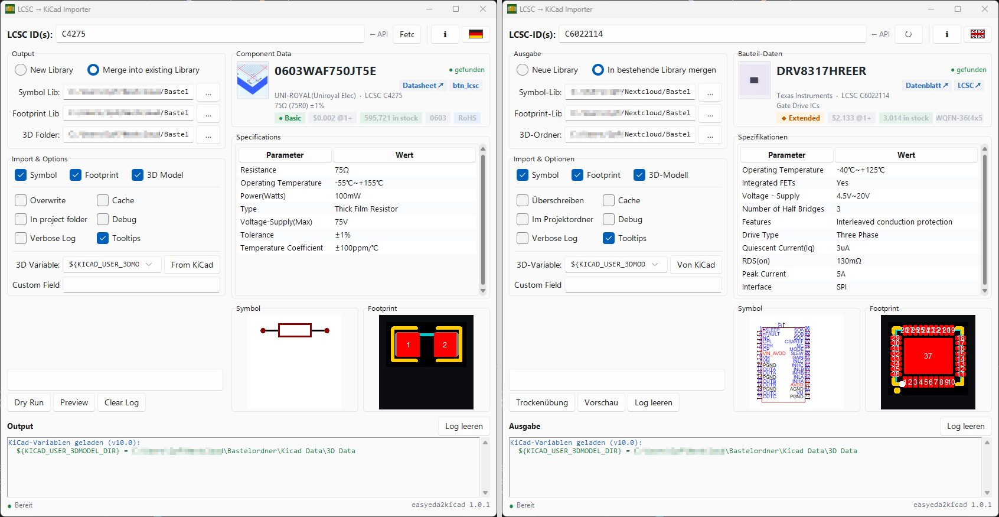

# LCSC → KiCad Importer GUI

[🇩🇪 Deutsch](#deutsch)

A small Python/tkinter GUI wrapper around [easyeda2kicad](https://github.com/uPesy/easyeda2kicad.py) that imports LCSC components into KiCad libraries.

*Ein kleines Python/tkinter-GUI für [easyeda2kicad](https://github.com/uPesy/easyeda2kicad.py), das LCSC-Bauteile in KiCad-Bibliotheken importiert.*



## Usage

**EXE (no Python needed):** download from the [Releases page](../../releases/latest) and run `lcsc_importer.exe`.

> **Windows SmartScreen warning?** The EXE is not code-signed, so Windows may flag it as unrecognized. Click **"More info" → "Run anyway"** to proceed.

**From source** (Python 3.9+):
```
pip install easyeda2kicad Pillow sv-ttk
python lcsc_importer.py
```

## Features

- **Component data card** — as you type an LCSC ID, the card shows the MPN, manufacturer, type (Basic/Extended), price, stock, package, and RoHS status pulled from the JLCPCB API; links to the datasheet and LCSC product page open in the browser
- **Parametric specs table** — full attribute list (voltage, current, topology, etc.) fetched from the JLCPCB API 
- **Part photo** — product image shown as a thumbnail in the card; click to open a zoomable popup (scroll to zoom), also visible full-size in the preview window
- **Live symbol & footprint preview** — thumbnails render automatically as you type; click to enlarge
- **Batch import** — paste multiple IDs (comma / semicolon / space separated); a confirmation dialog shows all resolved names before importing
- **Two output modes** (switchable via radio button):
  - **New library** — creates separate output folders for symbols (`MPN.kicad_sym`), footprints (`MPN.pretty/`) and 3D models (`MPN.3dshapes/`)
  - **Merge into existing library** — merges the symbol into an existing `.kicad_sym` file and copies footprints / 3D models into existing folders
- **3D path fix** — replaces the absolute paths easyeda2kicad writes into `.kicad_mod` files with a configurable KiCad path variable (e.g. `${KICAD_USER_3DMODEL_DIR}`)
- **All CLI options exposed** — `--overwrite`, `--use-cache`, `--project-relative`, `--debug`, `--custom-field`
- **DE / EN UI** — toggle the interface language with the flag button in the top bar
- **Persistent settings** — output paths are saved to `lcsc_importer_config.json` next to the script (excluded from git)

## Notes

- Set `${KICAD_USER_3DMODEL_DIR}` in **KiCad → Preferences → Configure Paths** to point to your 3D models base folder so the path variable resolves correctly.
- `lcsc_importer_config.json` stores your local folder paths and is intentionally not tracked by git.

## License

MIT — see [LICENSE](LICENSE).

---

## Deutsch

[🇬🇧 English](#lcsc--kicad-importer-gui)

### Verwendung

**EXE (kein Python erforderlich):** von der [Releases-Seite](../../releases/latest) herunterladen und `lcsc_importer.exe` ausführen.

> **Windows SmartScreen-Warnung?** Die EXE ist nicht code-signiert, daher kann Windows sie als unbekannt markieren. Klicke auf **„Weitere Informationen" → „Trotzdem ausführen"**.

**Aus dem Quellcode** (Python 3.9+):
```
pip install easyeda2kicad Pillow sv-ttk
python lcsc_importer.py
```

### Funktionen

- **Bauteil-Datenkarte** — beim Eingeben einer LCSC-ID zeigt die Karte MPN, Hersteller, Typ (Basic/Extended), Preis, Lagerbestand, Package und RoHS-Status aus der JLCPCB-API; Links zu Datenblatt und LCSC-Produktseite öffnen im Browser
- **Parametrische Spezifikationstabelle** — vollständige Attributliste (Spannung, Strom, Topologie etc.) aus der JLCPCB-API
- **Bauteilfoto** — Produktbild als Thumbnail in der Karte; Klick öffnet ein zoombares Popup (Scrollen zum Zoomen), auch in voller Größe im Vorschaufenster
- **Live Symbol- & Footprint-Vorschau** — Thumbnails werden automatisch beim Tippen gerendert; Klick zum Vergrößern
- **Batch-Import** — mehrere IDs einfügen (komma-, semikolon- oder leerzeichengetrennt); ein Bestätigungsdialog zeigt alle aufgelösten Namen vor dem Import
- **Zwei Ausgabemodi** (per Radio-Button wählbar):
  - **Neue Bibliothek** — erstellt separate Ausgabeordner für Symbole (`MPN.kicad_sym`), Footprints (`MPN.pretty/`) und 3D-Modelle (`MPN.3dshapes/`)
  - **In bestehende Bibliothek mergen** — fügt das Symbol in eine bestehende `.kicad_sym`-Datei ein und kopiert Footprints / 3D-Modelle in bestehende Ordner
- **3D-Pfad-Korrektur** — ersetzt die absoluten Pfade, die easyeda2kicad in `.kicad_mod`-Dateien schreibt, durch eine konfigurierbare KiCad-Pfadvariable (z.B. `${KICAD_USER_3DMODEL_DIR}`)
- **Alle CLI-Optionen verfügbar** — `--overwrite`, `--use-cache`, `--project-relative`, `--debug`, `--custom-field`
- **DE / EN Benutzeroberfläche** — Sprache über den Flaggen-Button in der Titelleiste wechseln
- **Einstellungen werden gespeichert** — Ausgabepfade werden in `lcsc_importer_config.json` neben dem Skript gespeichert (nicht von git verfolgt)

### Hinweise

- `${KICAD_USER_3DMODEL_DIR}` unter **KiCad → Einstellungen → Pfade konfigurieren** auf den Basisordner der 3D-Modelle setzen, damit die Pfadvariable korrekt aufgelöst wird.
- `lcsc_importer_config.json` speichert lokale Ordnerpfade und wird absichtlich nicht von git verfolgt.

### Lizenz

MIT — siehe [LICENSE](LICENSE).
