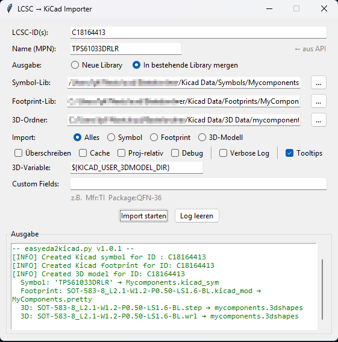

# LCSC → KiCad Importer GUI

A small Python/tkinter GUI wrapper around [easyeda2kicad](https://github.com/uPesy/easyeda2kicad.py) that imports LCSC components into KiCad libraries.



## Requirements

- Python 3.9+
- `easyeda2kicad` — install via pip:
  ```
  pip install easyeda2kicad
  ```

## Usage

```
python lcsc_importer.py
```

## Features

- **MPN auto-fetch** — enter an LCSC ID and the component name is fetched from the EasyEDA API automatically
- **Batch import** — paste multiple IDs (comma / semicolon / space separated); a confirmation dialog shows all resolved names before importing
- **Two output modes** (switchable via radio button):
  - **Neue Library** — places each component into three separate target folders you configure:
    - Symbols folder → `MPN.kicad_sym`
    - Footprints folder → `MPN.pretty/`
    - 3D folder → `MPN.3dshapes/`
  - **In bestehende Library mergen** — merges the symbol into an existing `.kicad_sym` file, copies footprints into an existing `.pretty` folder, and copies 3D models into an existing `.3dshapes` folder
- **3D path fix** — easyeda2kicad writes absolute paths into `.kicad_mod` files; this tool replaces them with a configurable KiCad path variable (e.g. `${KICAD_USER_3DMODEL_DIR}`)
- **All CLI options exposed** — `--overwrite`, `--use-cache`, `--project-relative`, `--debug`, `--custom-field`
- **Persistent settings** — output paths are saved to `lcsc_importer_config.json` next to the script (excluded from git)

## Notes

- Set `${KICAD_USER_3DMODEL_DIR}` in **KiCad → Preferences → Configure Paths** to point to your 3D models base folder so the path variable resolves correctly.
- `lcsc_importer_config.json` stores your local folder paths and is intentionally not tracked by git.

## License

MIT — see [LICENSE](LICENSE).
